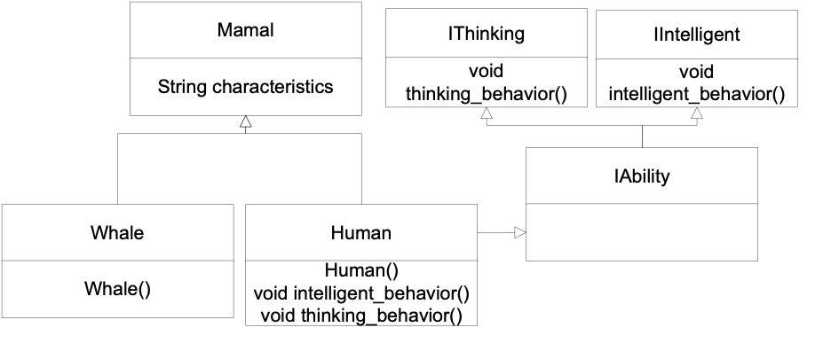

# Bài tập Lab 1

1. Thành viên trong nhóm tạo tài khoản Github.

2. Nhóm trưởng tạo repository có tên "IT008" và invite các thành viên vào chung repository.
Nhóm trưởng tạo file README.md và thêm thông tin nhóm vào.

3. Các thành viên cùng làm một bài Lab, chú ý về các vấn đề checkout, chia branch, merge, ...

4. Tạo các folder tương ứng với tên lab, ví dụ Lab 1 và commit/push bài tập Lab theo đúng deadline. Bài tập có mốc thời gian commit trễ bị trừ 2đ.

Lưu ý:
- Điểm sẽ được tính theo lượng đóng góp vào repository. Ai có đóng góp ít sẽ được điểm thấp hơn.
- Lưu ý nên để private repository.
- Xem kĩ video hướng dẫn nếu chưa từng sử dụng Git/Github.

Tham khảo:

1. [Cách sử dụng Git/Github](https://www.youtube.com/watch?v=1JuYQgpbrW0)


### Tại lớp

**Bài tập 1.1**: Viết các class hình học căn bản (hình tròn, hình chữ nhật, hình vuông, hình tam giác) thỏa các điều kiện sau:
- Một lớp trừu tượng ```Shape```.
- Các lớp hình chữ nhật, hình tròn, hình tam giác kế thừa từ lớp trừu tượng ```Shape```.
- Lớp hình vuông  kế thừa từ hình chữ nhật.
- Các lớp hình học có các thuộc tính vị trí, thuộc tính tên của hình đó, có các hàm tính diện tích, hàm vẽ xuất ra vị trí và các tính chất của hình. 

Yêu cầu về chương trình: chương trình yêu cầu người dùng nhập số hình muốn tạo $n$. Với hình thứ $i$ sẽ được hệ thống chọn ngẫu nhiên một trong các loại hình đã được định nghĩa và sau đó yêu cầu người dùng nhập thông tin cần thiết. Sau khi nhập tất cả thông tin của $n$ hình, hệ thống xuất ngược lại thông tin từ hàm vẽ và hàm tính diện tích của các hình đã được nhập.


**Bài tập 1.2**: Cài đặt class phân số theo yêu cầu dưới đây:

- Sử dụng các toán tử ```+, -, *, /``` cho phân số.
- Sử dụng toán tử so sánh ```==, !=, <, >``` cho phân số.

Cài đặt:

- Hàm chuyển đổi kiểu ngầm định từ số nguyên ra phân số và chuyển đổi tường minh từ phân số ra số thực.
- Implement interface Icomparable, test với phương thức ```Array.Sort()```.

**Bài tập 1.3**: Viết chương trình đơn giản thỏa các yêu cầu dưới đây:
- Một hàm có khả năng tìm số lớn nhất trong một dãy các số nguyên, số lớn nhất trong một dãy các số thực, chuỗi dài nhất trong một dãy chuỗi.
- Một hàm có khả năng tìm số nhỏ nhất trong một dãy các số nguyên, số nhỏ nhất trong một dãy các số thực, chuỗi ngắn nhất trong một dãy chuỗi. 

### Về nhà (2 tuần)

**Bài tập 1.4**: Viết một chương trình biễu diễn sự kiện (Event) thay đổi nhiệt độ của nhiêt kế. Chương trình thỏa các yêu cầu:
- Lớp nhiệt kế cơ bản.
- Lớp màn hình hiển thị nhiệt độ của nhiệt kế (Test với việc random nhiệt độ của nhiệt kế nhiều lần để mỗi lần thì lớp màn hình thể hiện nhiệt độ mới)

**Bài tập 1.5**: Yêu cầu người dùng nhập vào đường dẫn thư mục. Chương trình xuất tất cả các tập tin trong thư mục, nếu đường dẫn thư mục không tồn tại, xuất thông báo. Sử dụng class ```Directory``` trong ```System.IO```.

**Bài tập 1.6**: Cài đặt cấu trúc chương trình theo cây kế thừa bên dưới.



*Interface*: ```IThinking, IIntelligent, IAbility.```

*Class*: ```Mamal, Whale, Human.```

---
&copy; SE-UIT 2023
Materials for **Visual programming - IT008** 