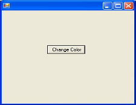
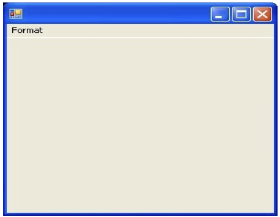
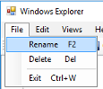
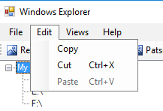
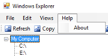

# Bài tập lab 2

### Trên lớp

**Bài tập 2.1**: Viết chương trình minh hoạ các sự kiện trong vòng đời của form. Gợi ý: *tìm hiểu các sự kiện Load, Activated, Shown, Deactivate, FormClosing, FormClosed.*

**Bài tập 2.2**:  Viết chương trình minh hoạ sự kiện Click trên Button. Khi nhấn vào nút Change Color sẽ tiến hành chuyển màu nền của Form sang một màu ngẫu nhiên.

**Bài tập 2.3**: Viết chương trình minh hoạ sử dụng Menu và hộp thoại ColorDialog:

- Khi chọn chức năng Color trong menu Format sẽ mở ra hộp thoại ColorDialog.

- Sau khi chọn màu trong hộp thoại ColorDialog sẽ tiến hành đổi màu nền của Form theo màu đã chọn

Gợi ý: *sử dụng các class MainMenu, MenuItem, ColorDialog.*

### Về nhà

**Bài tập 2.4**: Viết chương trình minh hoạ sự kiện Paint trên Form. Mỗi khi sự kiện Paint xảy ra sẽ vẽ lại chuỗi “Paint Event” tại một vị trí x, y ngẫu nhiên trên Form. Gợi ý: *tìm hiểu về sự kiện Paint trên form và các lớp Random, Graphics.*

Chọn ít nhất 1 trong số các bài sau.

**Bài tập 2.5**. Xây dựng Windows Explorer đơn giản với mô tả như sau:

- 1 cửa sổ làm việc chính frmMain, trên frmMain sẽ có 2 panel: 
  + panel bên trái hiển thị và cho phép người dùng duyệt các phân vùng ổ disk và thư mục (sử dụng treeview). 
  + panel bên phải hiển thị thư mục, tập tin con của thư mục hay phân vùng được chọn hiện tại (sử dụng listview). 

Thiết kế các giao diện cho các chức năng theo mô tả bên dưới chứa trong menustrip.

a. Mục File cho phép rename, delete thư mực hoặc file được chọn hiện tại ở listview bên phải.

b. Mục Edit cho phép Copy, Cut, Paste thư mực hoặc file được chọn hiện tại ở listview bên phải

c. Mục View cho phép chỉnh chế độ xem Large icons, small icons, list icon, list, details.

d. Toolbar

- Up: đi lên thư mục cha của thư mục đang được xem hiện tại.
- Refresh: loại lại thự mục đang xem hiện tại.
- Copy, cut, paste, delete:  Copy, cut, paste, delete thư mục hoặc file đang được chọn ở mục listview bên phải.
- View: cho phép người dùng chọn cách view của listview bên phải

**Bài tập 2.6**: Xây dựng chương trình quản lý sinh viên có các chức năng:

- Xem danh sách sinh viên và thông tin chi tiết của một sinh viên.
- Thêm mới/sửa một sinh viên.
- Xoá sinh viên

Lưu ý: dữ liệu phải được lưu tại cơ sở dữ liệu, ví dụ: SQL Server, MySQL, SQLite.

**Bài tập 2.7**. Viết chương trình hỗ trợ hẹn giờ thực hiện 1 trong 3 hành vi sau: shutdown hệ điều hành, restart hệ điều hành, log out người dùng hiện tại. (tất cả đều trên hệ điều hành windows). Nếu người dùng đã hẹn giờ nhưng chưa đến giờ hẹn sẽ cho phép người dùng hủy thao tác đã đặt hẹn với chức năng hủy.

**Bài tập 2.8**: Nâng cấp từ **Bài tập 2.4** với các chức năng mới như sau:

- Các loại hình vẽ: Vẽ tự do, Hình chữ nhật, Hình eclip
- Thao tác vẽ: Với các loại Hình chữ nhật, Hình eclip, cho phép hiệu chỉnh sửa (thay đổi kích thước, di chuyển) ngay sau khi vẽ
- Chọn màu vẽ, nét vẽ và lưu các hình đang vẽ ra file ảnh.

**Bài tập 2.9**:

Viết ứng dụng text editor đơn giản để hỗ trợ các chức năng mở (đọc), lưu, tạo và hiểu chỉnh một file text (sử dụng rich text box để editor nội dung).

- Để kiểm soát người dùng hiện tại, hệ thống có chức năng đăng ký và đăng nhập (dữ liệu user được mã hóa AES-128 và lưu vào file user.txt), đăng xuất. 
- Lúc mở chương trình hệ thống sẽ hiển thị một cửa sổ đăng nhập đè trên cửa sổ ứng dụng chính. Cửa sổ này cho phép người dùng đăng nhập và có button đăng ký nếu muốn đăng ký mới. 
- Nếu đăng nhập thành công cửa sổ đăng nhập sẽ biến mất và cho phép người dùng làm việc với cửa số chính. Nếu đăng nhập sai yêu cầu đăng nhập lại. Nếu muốn tạo tài khoản thì cửa sổ đăng nhập biến mất và một cửa sổ đăng ký sẽ xuất hiện cho phép đăng ký (yêu cầu username, password, re-password). Sau khi đăng kí thành công cửa số đăng ký sẽ biến mất và cho phép người dùng làm việc với cửa số chính.

---
&copy; SE-UIT 2023
Materials for **Visual programming - IT008** 
