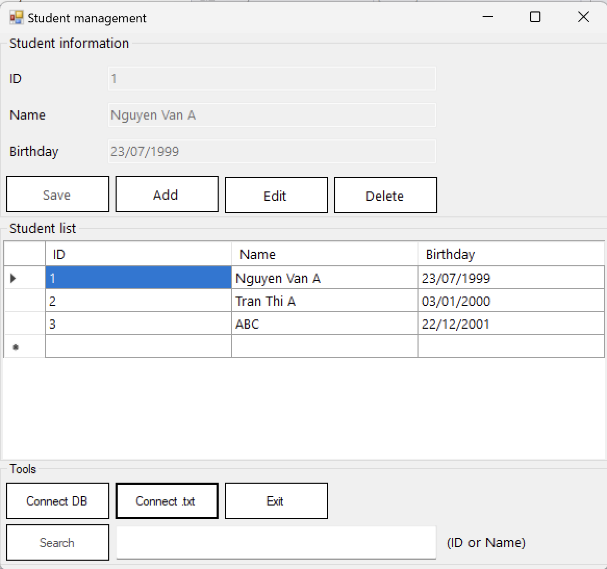

# Bài tập lab 4

### Trên lớp

**Bài tập 4.1**: Xây dựng ứng dụng quản lý sinh viên đơn giản, thông tin mỗi sinh viên bao gồm (ID, Họ tên, Ngày sinh), trong đó ID được tự động tăng (người dùng không nhập) và ngày sinh phải là ngày sinh hợp lệ. Ứng dụng có các chức năng:

- Kết nối đến database hoặc file txt, mọi thao tác đọc - ghi dữ liệu sẽ lưu vào database hoặc file txt.

- Hỗ trợ các thao tác CRUD (Create - Read - Update - Delete) và thao tác search theo ID / Họ tên.

UI của ứng dụng có thể tham khảo như sau:

*Tham khảo: Old projects/DatabaseManagement.*
### Về nhà
Không có bài tập về nhà, các nhóm tiếp tục thực hiện đồ án.

---
&copy; SE-UIT 2023
Materials for **Visual programming - IT008** 
